# StableDreamer: Taming Noisy Score Distillation Sampling for Text-to-3D ([arXiv](https://arxiv.org/abs/2312.02189))


<div align="center">

</div>


<p align="center">
<a href="https://scholar.google.com/citations?hl=en&user=O0yBqysAAAAJ"> Pengsheng Guo</a>,
<a href="https://scholar.google.com/citations?hl=en&user=IMn1m2sAAAAJ"> Hanxiang Hao</a>,
<a href="https://scholar.google.com/citations?hl=en&user=gc7htXwAAAAJ"> Adam Caccavale</a>,
<a href="https://scholar.google.com/citations?hl=en&user=iILS6kQAAAAJ"> Zhongzheng Ren</a>,
<a href="https://scholar.google.com/citations?hl=en&user=3kumBZQAAAAJ"> Edward Zhang</a>,
<a href="https://scholar.google.com/citations?hl=en&user=0FbnKXwAAAAJ"> Qi Shan</a>,
<a href="https://scholar.google.com/citations?hl=en&user=6ZDIdEAAAAAJ"> Aditya Sankar</a>,
<a href="https://scholar.google.com/citations?hl=en&user=3B2c31wAAAAJ"> Alex Schwing</a>,
<a href="https://scholar.google.com/citations?hl=en&user=PghQbXMAAAAJ"> Alex Colburn</a>,
<a href="https://scholar.google.com/citations?hl=en&user=kf07AjoAAAAJ"> Fangchang Ma</a>
<br> Apple 
</p>


## Summary
We present StableDreamer, a methodology incorporating three advancements to tame noisy score distillation sampling (SDS). It reduces multi-face geometries, generates fine details, and converges stably. Specifically, our contributions include:
1. Interpreting SDS as a **reparametrized supervised reconstruction** problem, leading to new visualization that motivates the use of an annealing schedule for noise levels.
2. A two-stage training framework that combines **image and latent diffusion** for enhanced geometry and color quality.
3. Integration of **3D Gaussians** for text-to-3D generation, with novel regularization techniques for improved quality and convergence, to further improve fidelity and details. 

<details>
  <summary>Expand Abstract</summary>
  
*In the realm of text-to-3D generation, utilizing 2D diffusion models through score distillation sampling (SDS) frequently leads to issues such as blurred appearances and multi-faced geometry, primarily due to the intrinsically noisy nature of the SDS loss. Our analysis identifies the core of these challenges as the interaction among noise levels in the 2D diffusion process, the architecture of the diffusion network, and the 3D model representation. To overcome these limitations, we present StableDreamer, a methodology incorporating three advances. First, inspired by InstructNeRF2NeRF, we formalize the equivalence of the SDS generative prior and a simple supervised L2 reconstruction loss. This finding provides a novel tool to debug SDS, which we use to show the impact of time-annealing noise levels on reducing multi-faced geometries. Second, our analysis shows that while image-space diffusion contributes to geometric precision, latent-space diffusion is crucial for vivid color rendition. Based on this observation, StableDreamer introduces a two-stage training strategy that effectively combines these aspects, resulting in high-fidelity 3D models. Third, we adopt an anisotropic 3D Gaussians representation, replacing Neural Radiance Fields (NeRFs), to enhance the overall quality, reduce memory usage during training, and accelerate rendering speeds, and better capture semi-transparent objects. StableDreamer reduces multi-face geometries, generates fine details, and converges stably.*
</details>


## Results
| | DreamFusion | ProlificDreamer | Gsgen | StableDreamer (Ours) |
| :---: | :---: | :---: | :---: | :---: |
| <sub> a zoomed out dslr photo of a baby bunny sitting on top of a stack of pancakes </sub> | 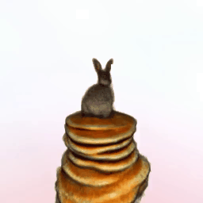 | 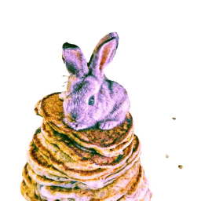 | 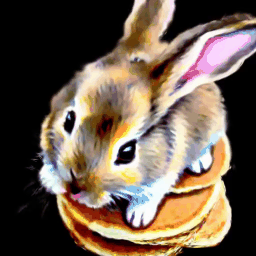 |  | 
| <sub> a zoomed out dslr photo of a rabbit cutting grass with a lawnmow </sub> | 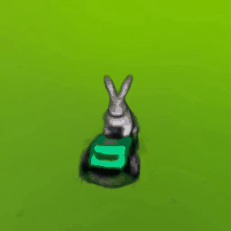 |  | 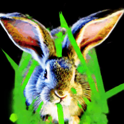 | 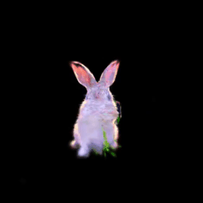 | 
| <sub> a wide angle dslr photo of a colorful rooster </sub> | 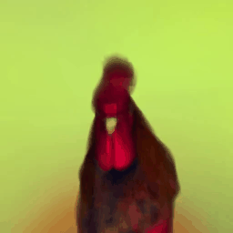 | 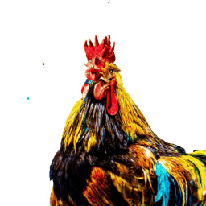 | 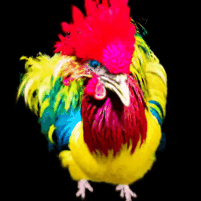 | 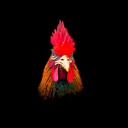 | 
| <sub> a dslr photo of a blue jay standing on a large basket of rainbow macarons </sub> | 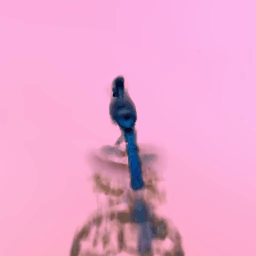 | 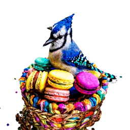 | 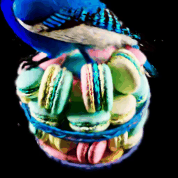 | 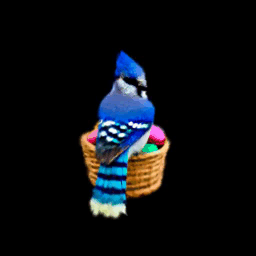 | 
| <sub> a dslr photo of a tarantula, highly detailed </sub> | 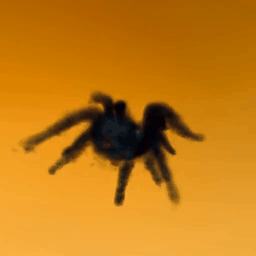 | 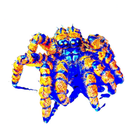 | 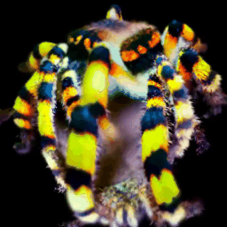 | 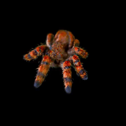 | 
| <sub> a zoomed out dslr photo of a corgi wearing a top hat </sub> | 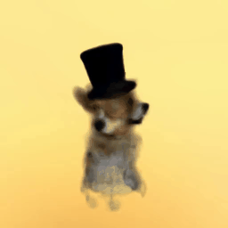 | 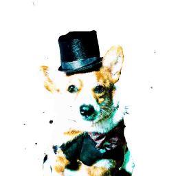 | 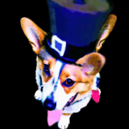 | 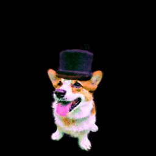 | 
| <sub> humoristic san goku body mixed with wild boar head running, amazing high tech fitness room digital illustration </sub> | 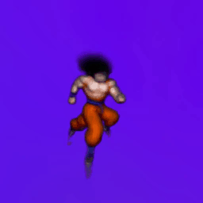 | 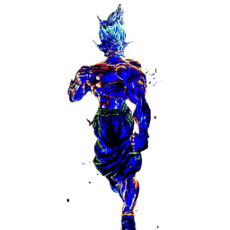 | 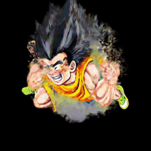 | 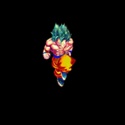 | 


## Related links

Check out recent related work of StableDreamer:

* [Threestudio: a unified framework for 3D content creation](https://github.com/threestudio-project/threestudio)
* [3D Gaussian Splatting for Real-Time Radiance Field Rendering](https://repo-sam.inria.fr/fungraph/3d-gaussian-splatting/)
* [Instant Neural Graphics Primitives with a Multiresolution Hash Encoding](https://nvlabs.github.io/instant-ngp/)
* [DreamFusion: Text-to-3D using 2D Diffusion](https://dreamfusion3d.github.io)
* [Magic3D: High-Resolution Text-to-3D Content Creation](https://nv-tlabs.github.io/publication/2022_arxiv_magic3d/)
* [ProlificDreamer: High-Fidelity and Diverse Text-to-3D Generation with Variational Score Distillation](https://ml.cs.tsinghua.edu.cn/prolificdreamer/)
* [Gsgen: Text-to-3D using Gaussian Splatting](https://gsgen3d.github.io)

## Citation

```
@misc{guo2023stabledreamer,
      title={StableDreamer: Taming Noisy Score Distillation Sampling for Text-to-3D}, 
      author={Pengsheng Guo and Hans Hao and Adam Caccavale and Zhongzheng Ren and Edward Zhang and Qi Shan and Aditya Sankar and Alexander G. Schwing and Alex Colburn and Fangchang Ma},
      year={2023},
      eprint={2312.02189},
      archivePrefix={arXiv},
      primaryClass={cs.CV}
}
```
